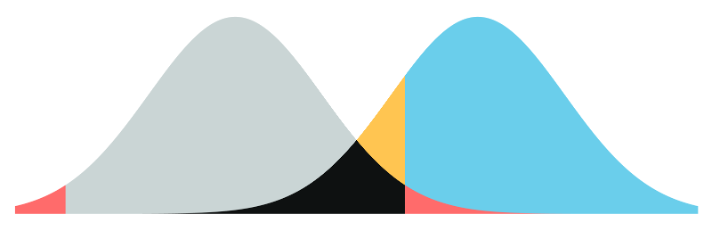

# ds_stat

Materiais do curso Ciência de Dados Aplicada à Psicometria da Pós Graduação (mestrado e doutorado) da Universidade São Francisco

## Objetivo

-   Propiciar oportunidades de estudo dos conceitos básicos subjacentes aos métodos estatísticos freqüentemente empregados nas pesquisas em psicologia e educação.\
-   Exercitar a aplicação desses métodos em situações práticas da avaliação.\
-   Exercitar a interpretação e redação de informações estatísticas sobre os dados de pesquisa.\
-   Introduzir e exercitar o emprego do JASP e JAMOVI para análises estatísticas.

## Programa

1.  [Introdução à estatística e métodos quantitativos](http://www.labape.com.br/rprimi/ds/slides/a1_intro.html). Instalando JASP
2.  [Desenho de pesquisas em psicologia](http://www.labape.com.br/rprimi/ds/slides/a1_intro.html)
3.  [Examinando variáveis com com estatísticas descritivas e gráficos. Rodando análises descritivas no JASP](http://www.labape.com.br/rprimi/ds/slides/a2_descri_stats.ppt)
4.  Introdução a probabilidade e distribuições estatísticas. Teste de hipóteses. Estimação de parâmetros estatísticos a partir de amostras
    -   [Materiais do prof Dr. Tom Faukenberry](https://github.com/rprimi/courses/blob/master/canvas/bayes/lecture1.pdf)\
    -   [Calculadora de probabilidades para inferências](https://tomfaulkenberry.shinyapps.io/dist_calc/)\
5.  Comparando médias (t-test)
    -   [Materiais do prof Dr. Tom Faukenberry](https://github.com/rprimi/courses/blob/master/canvas/5301/lecture1.pdf)\
6.  Comparando médias de vários grupos (ANOVA)
    -   [Materiais do prof Dr. Tom Faukenberry](https://github.com/rprimi/courses/blob/master/canvas/5301/lecture3.pdf)\
7.  Correlação e regressão simples
8.  Comparando médias de vários grupos com ANOVA fatorial: parte 1
9.  Comparando médias de vários grupos com ANOVA fatorial: parte 2
10. Regressão múltipla
11. Análise psicométrica e análise fatorial
12. Análise de cluster

## Atividades

**Exercício 1**

Essa atividade tem o propósito de fazer você se familiarizar com o JASP. Utilizaremos o bando de dados chamado bd_titanic disponibilizado no Kaggle (<https://www.kaggle.com/>)

Primeiro se familiarize com o banco para entender as variáveis contidas nele. <https://www.kaggle.com/c/titanic/data> . Se familiarize com o site kaggle.

Sua tarefa será fazer uma análise exploratória dos dados utilizando os procedimentos de análise estudados na aula. Faça uma análise descritiva da idade dos passageiros do Titanic. Divida a amostra por sexo e por classe social e veja a idade em cada subgrupo. Explore quais variáveis estão relacionadas a variável *survival* (1: sobrevivente, 0: vítima).

**Exercício 2**

Nessa atividade você irá analisar um [banco de dados](http://www.labape.com.br/rprimi/ds/bd_b5.csv) de crianças e adolescentes que responderam a um questionário avaliando big-five (O: Abertura, C: Conscienciosidade, E: Extroversão, A: Amabilidade e N: Regulação de emoções negativas).
