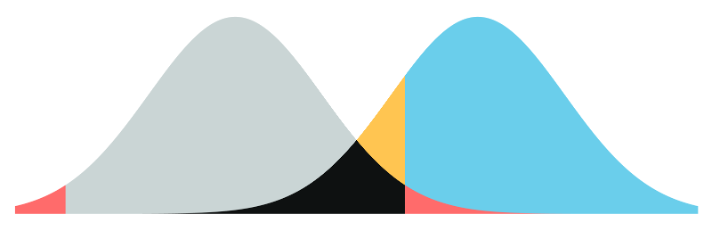

# SS1207 – Ciência de Dados em Psicometria

Materiais do curso Ciência de Dados Aplicada à Psicometria da Pós Graduação (mestrado e doutorado) da Universidade São Francisco

## Objetivo

-   Propiciar oportunidades de estudo dos conceitos básicos subjacentes aos métodos estatísticos e psicométricos freqüentemente empregados nas pesquisas em psicologia e educação.\
-   Exercitar a aplicação desses métodos em situações práticas da avaliação.\
-   Exercitar a interpretação e redação de informações estatísticas sobre os dados de pesquisa.\
-   Introduzir e exercitar o emprego do R e JASP para análises estatísticas e psicométricas.

## Programa

1.  Introdução: data science, machine learning e deep learnig\
    -   [t0_introdução.pptx](https://github.com/rprimi/ds_stat/blob/main/slides/t0_introdução.pptx)
2.  Instalação R e R-studio R-markdown e JASP\
    -   R e R-Studio - <https://cran.r-project.org> - <https://rstudio.github.io/visual-markdown-editing/#/>
    -   R-markdown Slides: <http://www.labape.com.br/rprimi/ds/garrett_grolemund_r_markdown.pdf>
    -   R-markdown cheatsheet <https://rstudio.com/wp-content/uploads/2015/02/rmarkdown-cheatsheet.pdf>
    -   Quarto: <https://r4ds.hadley.nz/quarto>
    -   Jasp <https://jasp-stats.org>
    -   Trazendo dados no R
    -   <https://www.oecd.org/en/about/projects/international-early-learning-and-child-well-being-study.html#data>
3.  Dados no R
    -   [Importa e entende dados no r](https://github.com/rprimi/ds_stat/blob/main/slides/dados_no_r.qmd)
    -   [Tipos de dados no R](https://github.com/rprimi/ds_stat/blob/main/slides/tipos_de_dados.qmd)
    -   [Estatísticas descritivas](https://github.com/rprimi/ds_stat/blob/main/slides/descritivas.qmd)
4.  Análise exploratória gráfica: ggplot
    -   [Estatísticas descritivas](https://github.com/rprimi/ds_stat/blob/main/slides/ggplot1.qmd)
    - Exercício com a base do ENEM
5.  Organização transformação e manipulação de dados: dplyr
    -   [dplyr](https://github.com/rprimi/ds_stat/blob/main/slides/dplyr.Rmd)
    
6.  Introdução a probabilidade e distribuições estatísticas. Teste de hipóteses. Estimação de parâmetros estatísticos a partir de amostras
    -   [Inferencia](https://github.com/rprimi/ds_stat/blob/main/slides/Inferencia.ppt)

7.  t-test e ANOVA
    -   [ANOVA](https://github.com/rprimi/ds_stat/blob/main/slides/Inferencia_ANOVA_regressaao.ppt)

8.  Regressão simples e múltipla
 ,,,-   [Regressão simples](https://github.com/rprimi/ds_stat/blob/main/slides/cor_regr_simples.pptx)
    -   [Regressão múltipla](https://github.com/rprimi/ds_stat/blob/main/slides/cor_regr_multipla.pptx)

9. Análise Psicométrica
10. Análise Fatorial Exploratória

## Atividades
